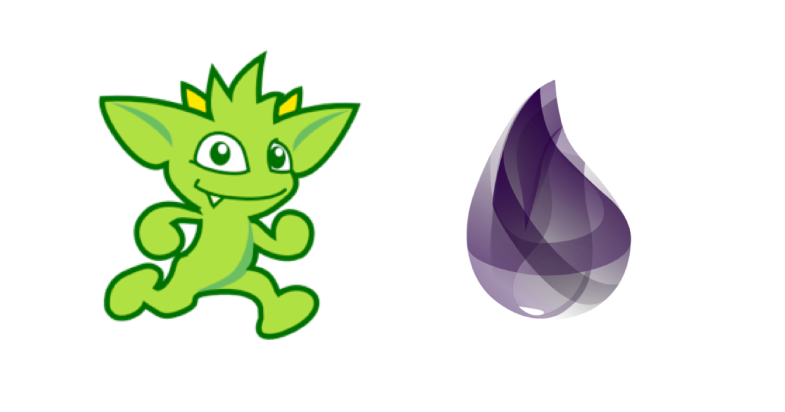

</img>

# ExGremlin

An Elixir client for Apache TinkerPop™ aka [Gremlin](http://tinkerpop.apache.org/gremlin.html) inspired by [Gremlex](https://github.com/Revmaker/gremlex).

ExGremlin does not support all functions (yet). It is pretty early on in it's development. But you can always use raw Gremlin queries by using `Client.query("<Insert gremlin query>")`

## Current State
- [x] Basic Implementations
- [ ] Support **all** gremlin functions
- [ ] Optimizing for Janusgraph
- [ ] Mix Commands

### Rewrite from [gremlex](https://github.com/Revmaker/gremlex)
- Reuse the main architecture and the main concept of gremlex
- change some library usages from gremlex
	- remove
		- [poolboy](https://github.com/devinus/poolboy) => write own client pool modules
		- [confex](https://github.com/Nebo15/confex) => not use
		- [httpoison](https://github.com/edgurgel/httpoison) => not use
	- [elixir-socket](https://github.com/meh/elixir-socket) => [gun (v2.0.0-rc.2)](https://github.com/ninenines/gun)
	- [poison](https://github.com/devinus/poison) => [jason](https://github.com/michalmuskala/jason)
	- [uuid(v1.1, rename elixir-uuid after v1.2)](https://github.com/zyro/elixir-uuid) => [uuid_erl](https://github.com/okeuday/uuid)

### [You can learn more about ExGremlin on the Wiki](https://github.com/chaehb/ex_gremlin/wiki)
